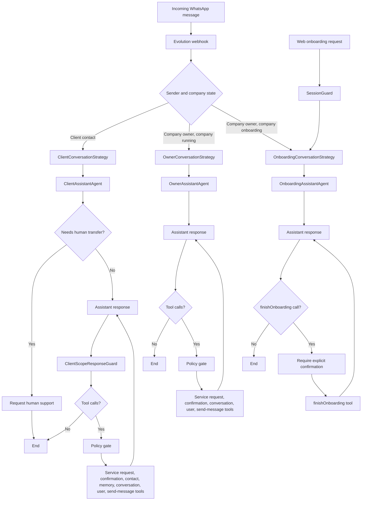

# Secretary Assistant

**Vision:** A webapp that lets small business owners configure and deploy a personal AI secretary agent integrated with their WhatsApp account, enabling automated customer support without manual intervention.
**For:** Small business owners who receive customer messages via WhatsApp
**Solves:** The burden of manually answering repetitive customer messages — the agent handles conversations autonomously, routing to the owner only when needed

## Goals

- Enable a business owner to set up their AI agent in minutes and have it answering WhatsApp messages automatically
- Support multiple conversation modes: client-facing support, owner interaction, and business onboarding
- Allow the agent to manage service requests end-to-end (create, track, update, confirm with client)

## Agent Flows

The system routes each conversation to one of three LangGraph agents based on
who sent the message and the company's onboarding state:

- **ClientAssistantAgent:** handles customer conversations, can transfer to a
  human owner, runs `ClientScopeResponseGuard` before returning a final client
  reply, and uses operational tools only after policy checks.
- **OwnerAssistantAgent:** helps the business owner inspect conversations,
  coordinate confirmations, send messages, and manage service requests.
- **OnboardingAssistantAgent:** guides initial setup and can only complete
  onboarding through `finishOnboarding` after explicit user confirmation.
- **SessionGuard:** protects authenticated web onboarding endpoints before the
  web chat reaches the onboarding conversation service.

## Tech Stack

**Core:**

- Framework: NestJS 11 (API) + React (Web SPA — planned)
- Language: TypeScript 5.7
- Database: PostgreSQL 17 + pgvector
- Runtime: Node.js >=20

**Key dependencies:**
- LangGraph + LangChain (agent orchestration)
- OpenAI GPT models + embeddings
- Evolution API (WhatsApp integration)
- TypeORM (ORM + migrations)

## Scope

**v1 includes:**

- WhatsApp integration via Evolution API (receive + send messages)
- AI agent with 3 conversation modes: client, owner, onboarding
- Service request management (create, update, confirm)
- Contact management (create, search, update)
- Company/owner setup and onboarding flow
- Persistent conversation memory (per thread + long-term via vector store)
- Web dashboard for agent configuration (React SPA)

**Explicitly out of scope:**

- Multi-channel support (other messaging platforms)
- Voice/audio responses (transcription only, no TTS)
- Billing / subscription management
- Mobile app

## Constraints

- Timeline: active development, no fixed deadline
- Technical: WhatsApp connectivity requires Evolution API running (Docker)
- Resources: solo/small team
