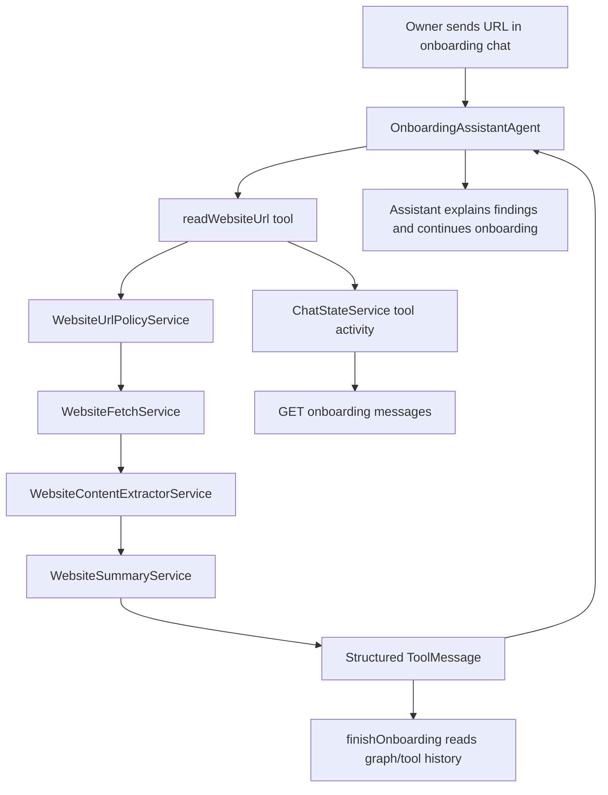

# Onboarding Website Ingestion Design

**Spec**: `api/.specs/features/onboarding-website-ingestion/spec.md`
**Status**: Draft

---

## Architecture Overview

The onboarding assistant gets one new onboarding-only tool,
`readWebsiteUrl`. The tool validates the URL, fetches bounded public
content, extracts readable text, summarizes business facts, and returns a
compact structured tool result to the agent.

The fetched website is treated as untrusted source data. It can inform the
assistant and company description, but it never becomes system instructions and
never overrides explicit owner statements.

This feature must integrate with both active interviewing and onboarding
completion instead of creating a parallel company-profile pipeline. Reading a
website URL adds another source of onboarding evidence through ToolMessages in
the LangGraph conversation state. The interviewing agent receives that evidence
during the conversation, and `finishOnboarding` remains the single place that
merges onboarding evidence into the canonical company description.



---

## Code Reuse Analysis

### Existing Components to Leverage

| Component | Location | How to Use |
| --- | --- | --- |
| `OnboardingAssistantAgent` | `src/modules/ai/agents/onboarding-assistant.agent.ts` | Add the new tool to the onboarding graph only. |
| `FinishOnboardingTool` | `src/modules/ai/tools/finish-onboarding.tool.ts` | Extend final description prompt with website ToolMessage context. |
| `LangchainService` | `src/modules/ai/services/langchain.service.ts` | Summarize cleaned website text with the helper model path. |
| `Company` | `src/modules/companies/entities/company.entity.ts` | Keep final profile in `description`; no new website table for MVP. |
| LangGraph ToolMessages | `OnboardingAssistantAgent` graph state | Carry website summaries in the active agent conversation. |
| `Memory` | `src/modules/chat/entities/memory.entity.ts` | Current persisted transcript source; may need alignment so finalization can include tool evidence. |
| Existing StructuredTool pattern | `src/modules/ai/tools/*.tool.ts` | Implement `ReadWebsiteUrlTool` consistently with existing tools. |
| Existing policy gate | `src/modules/ai/policies/*` | Keep `finishOnboarding` confirmation enforcement unchanged; no special policy needed for URL reading beyond tool validation. |

### Integration Points

| System | Integration Method |
| --- | --- |
| Onboarding chat | Existing free-form message path; URLs are sent as normal user text. |
| LangGraph tools | Add `ReadWebsiteUrlTool` to onboarding tools. |
| Database | No new website-ingestion table in MVP. Final output still writes `companies.description`. |
| HTTP network | Node `fetch` with manual redirect validation, timeout, max bytes, and DNS/IP checks. |
| LLM | Use `LangchainService.chat(...)` for constrained summarization after deterministic text extraction. |
| Chat state | Extend existing `ChatStateService` typing state with contextual activity for tool execution. |

---

## Components

### WebsiteUrlPolicyService

- **Purpose**: Normalize and validate user-provided URLs before any network
  request.
- **Location**: `src/modules/companies/services/website-url-policy.service.ts`
- **Interfaces**:
  - `execute(url: string): Promise<ValidatedWebsiteUrl>` - returns normalized
    URL and resolved address metadata or throws a recoverable domain error.
- **Dependencies**: Node DNS APIs, IP range helpers.
- **Reuses**: Existing single-method service convention.

### WebsiteFetchService

- **Purpose**: Fetch bounded public website content after URL validation.
- **Location**: `src/modules/companies/services/website-fetch.service.ts`
- **Interfaces**:
  - `execute(input: ValidatedWebsiteUrl): Promise<WebsiteFetchResult>` - fetches
    content with timeout, redirect, byte, and content-type limits.
- **Dependencies**: `fetch`, `AbortController`, `WebsiteUrlPolicyService` for
  every redirect target.
- **Reuses**: Nest injectable service pattern.

### WebsiteContentExtractorService

- **Purpose**: Convert supported HTML/plain text responses into clean readable
  text and metadata.
- **Location**: `src/modules/companies/services/website-content-extractor.service.ts`
- **Interfaces**:
  - `execute(input: WebsiteFetchResult): WebsiteExtractResult`
- **Dependencies**: `cheerio` or equivalent HTML parser.
- **Reuses**: No existing parser; add a focused dependency instead of regex HTML
  parsing.

### WebsiteSummaryService

- **Purpose**: Summarize extracted text into business-profile Markdown.
- **Location**: `src/modules/companies/services/website-summary.service.ts`
- **Interfaces**:
  - `execute(input: WebsiteExtractResult): Promise<WebsiteSummaryResult>`
- **Dependencies**: `LangchainService`.
- **Reuses**: Existing helper LLM service and prompt style used by
  `FinishOnboardingTool`.

### ReadWebsiteUrlTool

- **Purpose**: Agent-facing tool that orchestrates validation, fetch,
  extraction, and summarization.
- **Location**: `src/modules/ai/tools/read-website-url.tool.ts`
- **Interfaces**:
  - Tool schema: `{ url: string; reason?: string }`
  - Returns a compact Portuguese result with status, source URL, title,
    timestamp, and key facts.
- **Dependencies**: `WebsiteUrlPolicyService`, `WebsiteFetchService`,
  `WebsiteContentExtractorService`, `WebsiteSummaryService`.
- **Reuses**: Existing `StructuredTool` implementation pattern and `AgentState`
  context.

### ToolMessage Evidence Integration

- **Purpose**: Keep successful website summaries visible to the active graph and
  available to final onboarding.
- **Location**: `src/modules/ai/agents/onboarding-assistant.agent.ts`,
  `src/modules/ai/tools/finish-onboarding.tool.ts`
- **Interfaces**:
  - Tool result format should be structured enough for later extraction from
    graph state or persisted conversation history.
- **Dependencies**: LangGraph state/checkpointer behavior.
- **Reuses**: Existing tool-node behavior.

Context rule:

- The agent should receive structured summaries and extracted facts, not raw
  full-page HTML/text.
- The context should include source URLs and timestamps so the assistant can say
  where information came from.
- The context must be bounded so a company with many pages cannot overflow the
  prompt.
- The ToolMessage should include the newly ingested summary for the current
  assistant turn and for future graph-state turns.
- `finishOnboarding` must be updated so final description generation includes
  relevant ToolMessages, not just user/assistant memories.

### Tool Activity State

- **Purpose**: Let the web onboarding chat show what the assistant is doing
  while long-running tools execute.
- **Location**:
  `src/modules/message-queue/services/chat-state.service.ts`,
  `src/modules/onboarding/use-cases/get-onboarding-messages.use-case.ts`,
  `src/modules/ai/nodes/tool.node.ts`
- **Interfaces**:
  - `setActivity(conversationKey, activity)` - stores a typed activity with TTL.
  - `clearActivity(conversationKey)` - clears current activity.
  - `getState(conversationKey)` - returns generic typing or a structured
    activity.
- **Dependencies**: Existing Redis-backed chat state.
- **Reuses**: Current onboarding polling flow that already reads `isTyping`.

Suggested activity contract:

```typescript
type ChatActivity =
  | { kind: 'typing'; label: 'Assistente digitando...' }
  | { kind: 'tool'; toolName: 'readWebsiteUrl'; label: 'Pesquisando na web...' }
  | {
      kind: 'tool';
      toolName: 'finishOnboarding';
      label: 'Finalizando o onboarding...';
    };
```

Rules:

- Store stable activity codes; labels may be rendered by the API or mapped by
  the web, but the user-facing text must be consistent.
- Unknown tools should fall back to generic `Assistente trabalhando...` or
  `Assistente digitando...`.
- Activity state must have a TTL and must clear in `finally` paths.
- This should not affect WhatsApp typing/presence behavior.

### Finish Onboarding Integration

- **Purpose**: Include website-derived facts in the final company description.
- **Location**: `src/modules/ai/tools/finish-onboarding.tool.ts`
- **Interfaces**:
  - Read website tool evidence from `state.messages` and/or the graph state used
    by the current onboarding run.
- **Dependencies**: LangGraph state, existing `Memory` repository for persisted
  transcript.
- **Reuses**: Existing final Markdown generation flow.

Integration rule:

- `Memory` remains the source of the onboarding conversation.
- Website ToolMessages store source summaries inside the active graph history.
- `finishOnboarding` merges conversation memory and website ToolMessages into
  `Company.description`.
- Explicit owner statements in `Memory` take precedence over website summaries.
- Website summaries should not directly overwrite `Company.description` before
  onboarding is finalized.

---

## Data Models

### WebsiteToolResult

```typescript
interface WebsiteToolResult {
  status: 'success' | 'failed' | 'blocked' | 'unsupported' | 'no_content';
  url: string;
  normalizedUrl: string;
  title: string | null;
  fetchedAt: string;
  summaryMarkdown: string | null;
  keyFacts: string[];
  sourceMetadata: {
    statusCode?: number;
    contentType?: string;
    byteLength?: number;
    redirectChain?: string[];
  };
  errorReason: string | null;
}
```

**Persistence**: Stored as tool output in the LangGraph conversation state for
the MVP. A dedicated relational table can be added later if audit, refresh, or
cross-session retrieval requirements become stronger.

---

## Error Handling Strategy

| Error Scenario | Handling | User Impact |
| --- | --- | --- |
| Unsupported protocol | Reject in URL policy before DNS | Assistant asks for a public HTTP/HTTPS URL. |
| Private or localhost address | Reject in URL policy before fetch | Assistant says the site cannot be accessed and continues onboarding. |
| Redirect to blocked URL | Abort and return `blocked` | Assistant asks for another public page or manual details. |
| Timeout or network failure | Return `failed` with reason | Assistant continues onboarding manually. |
| Unsupported content type | Return `unsupported` | Assistant explains that the page format is not supported. |
| Empty/boilerplate page | Return `no_content` | Assistant asks owner for the missing facts. |
| LLM summarization failure | Return `failed`; do not alter company description | Assistant continues without website context. |

---

## Tech Decisions

| Decision | Choice | Rationale |
| --- | --- | --- |
| Agent exposure | Tool only on `OnboardingAssistantAgent` | The feature is specifically for setup and avoids client-facing network access. |
| Fetch implementation | Node `fetch` with manual redirect handling | Keeps dependency surface small and lets every redirect be revalidated. |
| HTML parsing | Add `cheerio` | Avoids fragile regex parsing and is sufficient for server-side static HTML extraction. |
| Persistence | No dedicated website ingestion table in MVP | The active graph ToolMessage is enough to support the interviewer and finalization without premature schema. |
| Final profile merge | Include summaries in `finishOnboarding` prompt | Keeps `finishOnboarding` as the single canonical profile-generation path while preserving owner-confirmation flow. |
| Interview context | Use structured ToolMessages | Lets the interviewing agent use site content before finalization and keeps the design reusable for owner-agent URL use later. |
| Crawling | Explicit URLs only | Supports multiple owner-provided URLs while avoiding automatic traversal. |
| Multiple URLs | Multiple single-URL tool calls in one turn | Keeps the tool simple and lets the agent decide which explicit URLs to read, subject to limits. |
| Tool loading labels | Extend chat state activity, not transcript messages | Gives live UI feedback without persisting fake assistant messages. |

---

## Security Constraints

- Only `http:` and `https:` are allowed.
- DNS results and redirect targets must reject loopback, private, link-local,
  multicast, unspecified, and other non-public ranges.
- Fetch must enforce configurable limits:
  - timeout, default 8 seconds
  - redirects, default 3
  - response bytes, default 1 MB
  - extracted text characters sent to LLM, default 40k
  - URLs per assistant turn, MVP default 1; P2 default 3 through repeated
    single-URL tool calls
- Do not execute JavaScript.
- Do not send raw HTML to the LLM; send cleaned text only.
- Summarization prompt must explicitly classify website text as untrusted source
  content.
