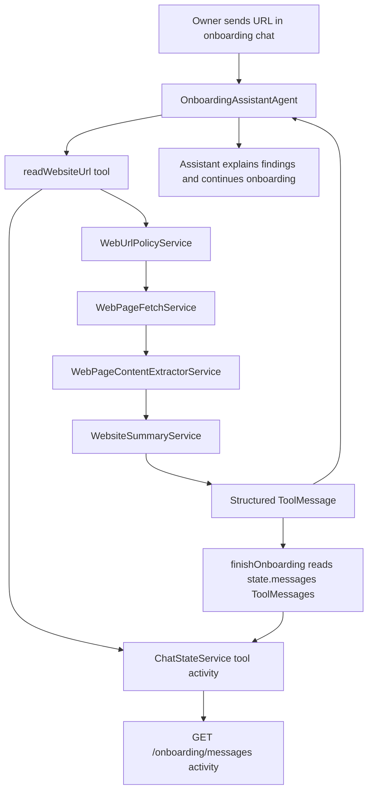

# Onboarding Website Ingestion Design

**Spec**: `api/.specs/features/onboarding-website-ingestion/spec.md`
**Status**: Draft

---

## Architecture Overview

The feature is split into three layers:

```text
web-content module -> AI URL-reading tool -> onboarding/web integration
```

`web-content` owns safe public page reading and text extraction. `AiModule` owns
LLM summarization and the `readWebsiteUrl` tool. Onboarding registers the tool
initially, uses its ToolMessages during the interview, and `finishOnboarding`
merges website ToolMessages with the onboarding conversation into the canonical
`Company.description`.



The fetched website is untrusted source data. It can inform the assistant and
final company description, but it never becomes system instructions and never
overrides explicit owner statements.

---

## Module Boundaries

### `WebContentModule`

- **Location**: `src/modules/web-content/`
- **Purpose**: Safe URL validation, bounded HTTP fetch, and text extraction.
- **May depend on**: Nest common/config, Node DNS/network APIs, HTML parser.
- **Must not depend on**: `AiModule`, `CompaniesModule`, `OnboardingModule`, or
  agent/tool classes.
- **Exports**:
  - `WebUrlPolicyService`
  - `WebPageFetchService`
  - `WebPageContentExtractorService`

### `AiModule`

- **Purpose**: LLM summarization, agent tool, and final profile merge.
- **Imports**: `WebContentModule`.
- **Owns**:
  - `WebsiteSummaryService`
  - `ReadWebsiteUrlTool`
  - `WebsiteToolResult` types
  - `finishOnboarding` ToolMessage merge behavior

### `OnboardingModule`

- **Purpose**: Existing onboarding conversation and message polling.
- **Owns**:
  - `GET /onboarding/messages` response activity contract
  - conversation state mapping for web polling

### `MessageQueueModule`

- **Purpose**: Existing Redis-backed chat state.
- **Change**: Extend typing state to structured activity state.

---

## Code Reuse Analysis

| Component | Location | How to Use |
| --- | --- | --- |
| `OnboardingAssistantAgent` | `src/modules/ai/agents/onboarding-assistant.agent.ts` | Add `readWebsiteUrl` to onboarding tools only. |
| `FinishOnboardingTool` | `src/modules/ai/tools/finish-onboarding.tool.ts` | Include successful `readWebsiteUrl` ToolMessages in final prompt. |
| `LangchainService` | `src/modules/ai/services/langchain.service.ts` | Summarize cleaned page text using helper model path. |
| LangGraph ToolMessages | `OnboardingAssistantAgent` graph state | Carry website summaries in active conversation. |
| `Memory` | `src/modules/chat/entities/memory.entity.ts` | Continue using persisted user/assistant transcript as conversation evidence. |
| `ChatStateService` | `src/modules/message-queue/services/chat-state.service.ts` | Extend existing typing state to expose tool activity labels. |
| Existing `StructuredTool` pattern | `src/modules/ai/tools/*.tool.ts` | Implement `ReadWebsiteUrlTool` consistently with existing tools. |

---

## Components

### WebUrlPolicyService

- **Purpose**: Normalize and validate user-provided URLs before any network
  request.
- **Location**: `src/modules/web-content/services/web-url-policy.service.ts`
- **Interface**:
  - `execute(url: string): Promise<ValidatedWebUrl>`
- **Rules**:
  - allow only `http:` and `https:`
  - resolve DNS before fetch
  - block localhost, loopback, private, link-local, multicast, unspecified, and
    invalid IP ranges

### WebPageFetchService

- **Purpose**: Fetch bounded public website content after URL validation.
- **Location**: `src/modules/web-content/services/web-page-fetch.service.ts`
- **Interface**:
  - `execute(input: ValidatedWebUrl): Promise<WebPageFetchResult>`
- **Rules**:
  - manual redirect handling
  - revalidate every redirect target with `WebUrlPolicyService`
  - enforce timeout, redirect, byte, and content-type limits

### WebPageContentExtractorService

- **Purpose**: Convert supported HTML/plain text responses into clean readable
  text and metadata.
- **Location**:
  `src/modules/web-content/services/web-page-content-extractor.service.ts`
- **Interface**:
  - `execute(input: WebPageFetchResult): WebPageContentResult`
- **Dependencies**: `@mozilla/readability`, `jsdom`.
- **Rules**:
  - parse HTML with `jsdom`
  - extract main readable content with `@mozilla/readability`
  - fall back to cleaned `body.textContent` when Readability returns no article
    or too little text
  - remove script/style/navigation-heavy noise in fallback extraction
  - return title, cleaned text, character count, and content hash

### WebsiteSummaryService

- **Purpose**: Summarize cleaned page text into business-relevant facts.
- **Location**: `src/modules/ai/services/website-summary.service.ts`
- **Interface**:
  - `execute(input: WebPageContentResult): Promise<WebsiteSummaryResult>`
- **Rules**:
  - treat page text as untrusted source content
  - output concise Portuguese Markdown and key facts
  - do not invent facts absent from the page

### ReadWebsiteUrlTool

- **Purpose**: Agent-facing tool that reads one explicit public URL and returns
  structured website evidence.
- **Location**: `src/modules/ai/tools/read-website-url.tool.ts`
- **Tool name**: `readWebsiteUrl`
- **Schema**: `{ url: string; reason?: string }`
- **Dependencies**:
  - `WebUrlPolicyService`
  - `WebPageFetchService`
  - `WebPageContentExtractorService`
  - `WebsiteSummaryService`
- **Output**: `WebsiteToolResult`

### Finish Onboarding Integration

- **Purpose**: Keep `finishOnboarding` as the canonical writer of
  `Company.description` while including website evidence.
- **Location**: `src/modules/ai/tools/finish-onboarding.tool.ts`
- **Rules**:
  - continue reading persisted user/assistant conversation from `Memory`
  - read successful `readWebsiteUrl` ToolMessages from `state.messages`
  - include website evidence in the final extraction prompt
  - explicit owner statements in the conversation override website evidence
  - raw page text must not be dumped into the final prompt

### Tool Activity State

- **Purpose**: Let the web onboarding chat show contextual loading labels while
  long-running tools execute.
- **Locations**:
  - `src/modules/message-queue/services/chat-state.service.ts`
  - `src/modules/onboarding/use-cases/get-onboarding-messages.use-case.ts`
  - `src/modules/ai/nodes/tool.node.ts`
- **Response contract**:

```typescript
type ChatActivity =
  | { kind: 'typing'; label?: string }
  | { kind: 'tool'; toolName: string; label?: string };
```

`GET /onboarding/messages` remains backward compatible:

```typescript
interface GetOnboardingMessagesResult {
  isTyping: boolean;
  activity: ChatActivity | null;
}
```

Labels:

| Activity | Label |
| --- | --- |
| `readWebsiteUrl` | `Pesquisando na web...` |
| `finishOnboarding` | `Finalizando o onboarding...` |
| unknown tool | `Assistente trabalhando...` |
| generic typing | `Assistente digitando...` |

Rules:

- Activity state has a TTL.
- Activity clears in `finally` paths.
- Redis-unavailable behavior remains no-op fallback.
- This does not affect WhatsApp typing/presence behavior.

---

## Data Models

### WebsiteToolResult

```typescript
interface WebsiteToolResult {
  status: 'success' | 'failed' | 'blocked' | 'unsupported' | 'no_content';
  url: string;
  normalizedUrl: string;
  title: string | null;
  fetchedAt: string;
  summaryMarkdown: string | null;
  keyFacts: string[];
  sourceMetadata: {
    statusCode?: number;
    contentType?: string;
    byteLength?: number;
    redirectChain?: string[];
  };
  errorReason: string | null;
}
```

Stored as tool output in the LangGraph conversation state.

---

## Error Handling Strategy

| Error Scenario | Handling | User Impact |
| --- | --- | --- |
| Unsupported protocol | Reject in URL policy before DNS | Assistant asks for a public HTTP/HTTPS URL. |
| Private or localhost address | Reject in URL policy before fetch | Assistant says the site cannot be accessed and continues onboarding. |
| Redirect to blocked URL | Abort and return `blocked` | Assistant asks for another public page or manual details. |
| Timeout or network failure | Return `failed` with reason | Assistant continues onboarding manually. |
| Unsupported content type | Return `unsupported` | Assistant explains that the page format is not supported. |
| Empty/boilerplate page | Return `no_content` | Assistant asks owner for the missing facts. |
| LLM summarization failure | Return `failed`; do not alter company description | Assistant continues without website context. |

---

## Tech Decisions

| Decision | Choice | Rationale |
| --- | --- | --- |
| Neutral page-reading boundary | `WebContentModule` | Avoids coupling company/domain modules to AI services and keeps URL reading reusable. |
| Summarization location | `AiModule` | LLM behavior belongs with AI tooling, not domain modules. |
| HTML extraction | `@mozilla/readability` + `jsdom` | Uses a proven reader-mode extraction library while keeping URL fetch/security in our code. |
| Tool name | `readWebsiteUrl` | Describes reading an explicit URL without implying persistence. |
| Initial agent exposure | Onboarding only | Keeps rollout narrow while preserving future owner-agent reuse. |
| Persistence | LangGraph ToolMessages | Supports interviewer and finalization without another storage path. |
| Multiple URLs | Repeated single-URL tool calls | Keeps the tool simple and lets the agent decide which explicit URLs to read. |
| Tool loading labels | Chat activity state | Gives live UI feedback without persisting fake assistant messages. |
