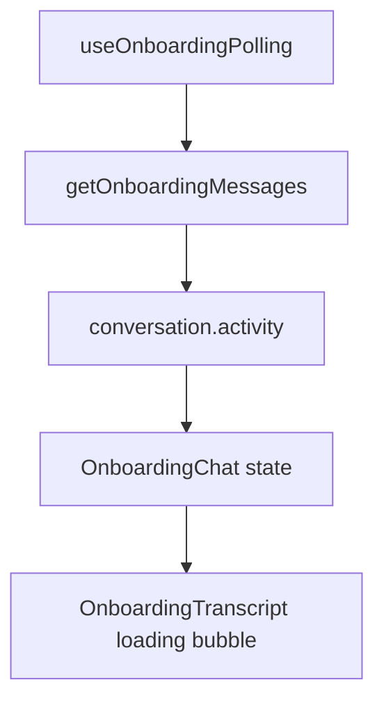

# Onboarding Website Ingestion Web Design

**Spec**: `web/.specs/features/onboarding-website-ingestion/spec.md`
**Status**: Draft

---

## Architecture Overview

The API continues to own conversation state. The web onboarding chat extends its
polling contract from `isTyping: boolean` to a backward-compatible activity
payload. The transcript still renders a temporary pending item; only the label
changes based on activity.



---

## Components

### Onboarding API Types

- **Location**: `web/app/modules/onboarding/api/onboarding.api.ts`
- **Change**: Add optional `activity` to `OnboardingConversation`.

```typescript
type OnboardingConversationActivity =
  | { kind: 'typing'; label?: string }
  | { kind: 'tool'; toolName: string; label?: string };
```

### Onboarding Chat State

- **Location**:
  `web/app/modules/onboarding/pages/onboarding-page/components/onboarding-chat.tsx`,
  `onboarding-chat.types.ts`
- **Change**: Pending assistant item carries a `label`.

### Onboarding Transcript

- **Location**:
  `web/app/modules/onboarding/pages/onboarding-page/components/onboarding-transcript.tsx`
- **Change**: Render pending assistant label from item data, falling back to the
  existing generic label.

---

## Error Handling

| Scenario | Handling |
| --- | --- |
| Missing `activity` | Use existing `isTyping` behavior. |
| Unknown tool name | Show `Assistente trabalhando...` or generic typing text. |
| Activity stays stale until timeout | Existing polling timeout path restores composer and clears pending item. |
